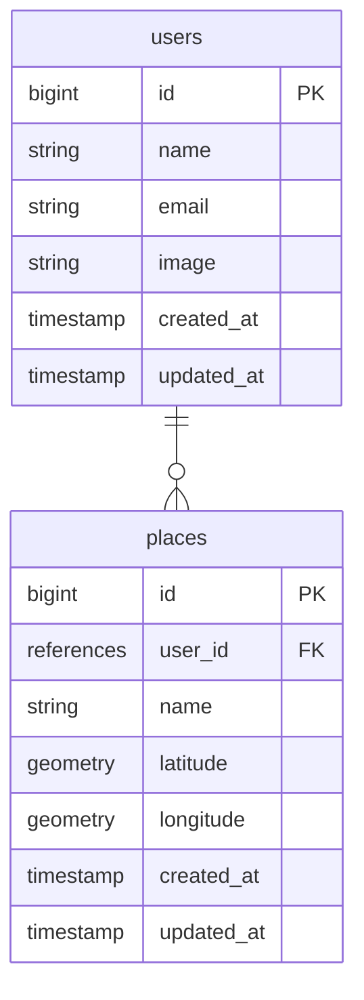

# michi-hura

## 概要
**みちふら**というサービスは、

**気分転換のために近場を散歩したいが、散歩ルートがマンネリ化している**を解決したい

**どこか近場で外出したい人**向けの、

**行き先提案アプリ**です。

ユーザーは**行き先をランダムに提案される**ができ、

**Googleマップを使って近所の散歩ルートを考える**とは違って、

**現在地を元に、半径10km圏内の史跡、観光名所の一覧からランダムに1つ行き先を選出する機能**が備わっている事が特徴です。

## リソース設計

| METHOD | PATH | DETAIL|
| ---- | ---- | ---- |
| GET | `/` | トップページ(選ばれた場所一覧) |
| POST | `/places` | 選ばれた場所を記録する |
| GET | `/places/new` | 現在地を元に場所を1つ選ぶ |
| GET | `/places/:id` | 選ばれた場所の詳細画面 |
| PUT | `/places/:id` | 選ばれた場所を編集する |
| DELETE | `/placees/:id` | 選ばれた場所を削除する |
| GET | `/terms` | 利用規約・プライバシーポリシーの表示 |
| POST | `/users/auth/google_outh2` | ログイン |
| POST | `/logout` | ログアウト |

## DB設計

